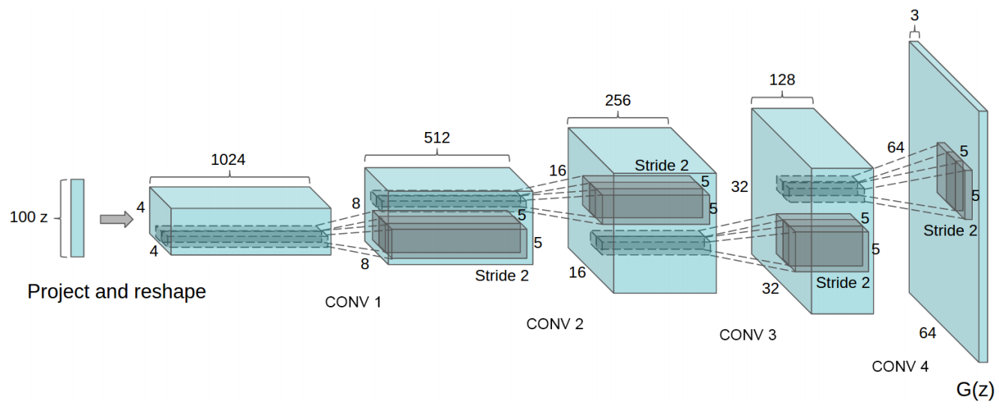

# 项目简介
---

本项目利用TensorFlow实现了简单的DCGAN(Deep Convolutional Generative Adeversarial Networks)，输入数据为图片，根据输入的图片对网络进行训练，最终目标是利用网络生成与输入图片类似的图片。

# 网络结构介绍
---

## Generative Adeversarial Networks(GAN)

生成模型(Generative Model)可以被用来生成与输入数据类似的数据，比如生成新闻报道等等。如果一个生成模型能够高质量的生成新闻文章，这同时也表明了模型内部对于新闻类的文章的特征有了比较好的表示，这也使得这个模型解决相关的工作成为可能，如对新闻文章进行分类等等。

训练生成模型一直是一个比较困难的任务，近些年来有一些方法被发现可以比较好的训练生成模型，GAN，也就是对抗生成网络，就是其中之一。整个网络结构可以分为两部分：

* Discriminative Model
* Generative Model

### Discriminative Model

Discriminative Model 也就是 Discriminator，以下简称 D，作用与普通的分类网络类似，对于给定的数据$x$和标签$y$，D的目标是学习条件概率$P(y|x)$。

### Generative Model

Generative Model 也就是 Generator，以下简称 G，对于给定的数据$x$和标签$y$，它的目标是学习联合概率分布$P(x, y)$，通过学习到的联合概率分布，希望可以生成新的$(x, y)$。

在GAN中，G 根据输入的随机噪声生成一些样本，D 同时接受 G 输出的样本，以及训练数据。在训练过程中，D 的目标是尽可能的分辨 G 生成的数据与输入的真实训练数据，而 G 的目标是生 D 难以分辨的样本。

    

### 训练算法

训练方法如下：

    

其中 $G(z_i;\theta_g)$将噪声 $z$ 映射到数据 $x$ 的空间中，$D(x;\theta_d)$ 输出为一个标量，$D(x)$ 表示输入 $x$ 来源是真实数据的概率。以上算法首先对 D 进行了 k 次训练，使得 D 的分辨能力有所提高，然后再训练 G，使得 G 生成的数据更加具有迷惑性。

## DCGAN

本项目中的网络结构中， G 和 D 都使用了卷积神经网络，所以名字叫做 DCGAN。

首先在 -1 到 1 按照均匀分布生成一个 100 维的向量，作为 G 的输入，然后经过多个卷积层最终生成大小为 64 \* 64 的图片作为 D 的输入，具体的参数设置如下图所示。 D 部分就是普通的 CNN 网络，对输入的图片进行判断，判断是否为人工生成的图片。

    

在图片生成的过程中，使用的卷积算方法与通常CNN网络中使用的略有所区别，根据 DCGAN 文章中的称谓应当叫做 *fractionally strided convolutions* 或者 *transposed convolutional*，计算方法可以理解为对输入进行了内插或者补0以后再卷积，具体的计算方法见后面参考资料。代码实现的时候可以使用TensorFlow中的[`tf.nn.conv2d_tranpose`](https://github.com/tensorflow/tensorflow/blob/b5df90f91cde6eb12af9cbe818bd2cf4a9bcc687/tensorflow/python/ops/nn_ops.py#L1140)函数完成。

    

# 使用
---

## 环境要求

* Python 2.7 或者 Python 3.5
* TensorFlow 1.4
* Pillow
* Numpy

## 训练模型

### 准备数据

在根目录建立图片文件夹`pics`，用于存放训练数据，图片要求为jpg格式，放在`pics`文件夹的子目录内，最终文件路径例如`pics/dog_1/1.jpg`

### 调节参数

`model/params.py`中记录了一些与模型相关的参数，如使用的激活函数，初始化使用的分布，图片的通道数量等。根目录下的`params.py`中记录了与训练相关的参数，如使用的优化算法，将`isTrain`设置为1表示对模型进行训练。

### 训练技巧

#### 归一化输入
* 归一化图片输入在 -1 到 1之间
* Generator 输出要经过 tanh 函数

#### 修改 loss 函数
在训练 Generator 的时候使用 $\max\log (D(G(z^{(i)}))$ 取代原有的 $\min \log (1 - D(G(z^{(i)}))$

#### 使用BatchNorm
对输入的 mini-batch 进行归一化处理

#### 避免稀疏梯度： RelU, MaxPool
* 在 G 和 D 中使用LeakyRelu
* 在 D 中使用 Average Pooling 来替代 MaxPool

# 训练结果

# 参考资料
---
* [DCGAN in Tensorflow](https://github.com/carpedm20/DCGAN-tensorflow)
* [Unsupervised Representation Learning with Deep Convolutional Generative Adversarial Networks](https://arxiv.org/abs/1511.06434)
* [Generative Adversarial Nets
](https://arxiv.org/pdf/1406.2661.pdf)
* [An introduction to Generative Adversarial Networks (with code in TensorFlow)](http://blog.aylien.com/introduction-generative-adversarial-networks-code-tensorflow/)
* [A guide to convolution arithmetic for deep
learning
](https://arxiv.org/pdf/1603.07285.pdf)